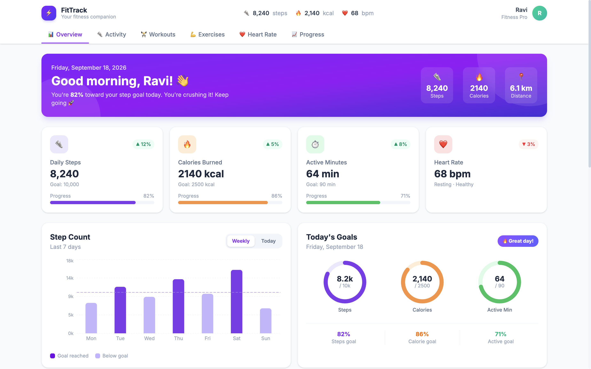
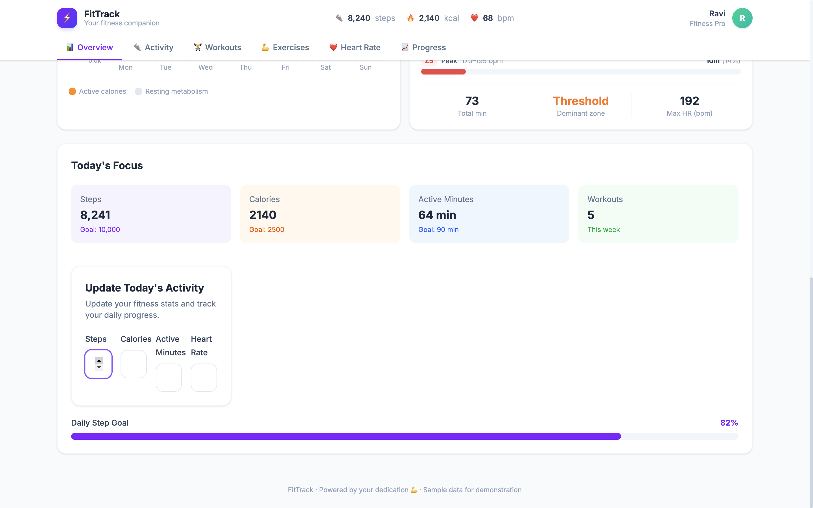
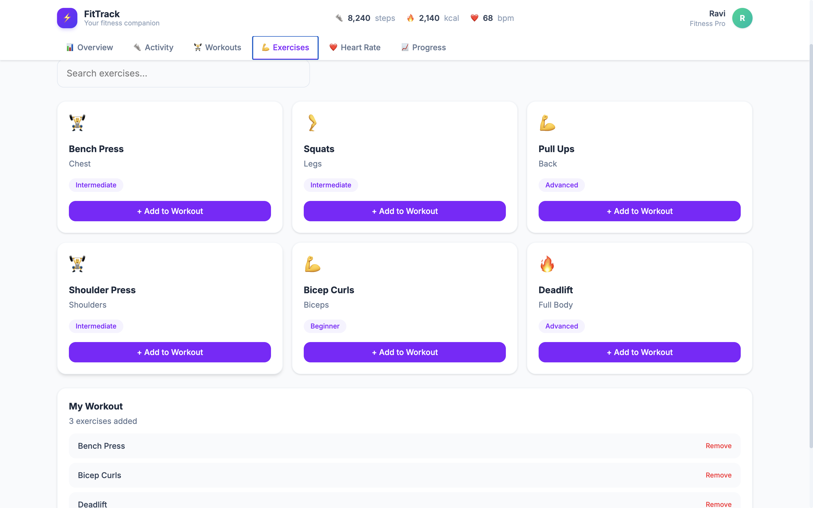

# FitTrack — Fitness Tracker Dashboard

A modern, responsive fitness tracker dashboard built with React, TypeScript, Tailwind CSS, and Recharts. FitTrack provides a comprehensive view of your daily fitness metrics including steps, calories, heart rate, workout history, and weekly progress trends.





---

## Features

### Overview Dashboard
- **Hero banner** with personalized greeting, daily progress percentage, and quick stats
- **Four stat cards** — Steps, Calories, Active Minutes, Heart Rate — each with progress bars and trend indicators
- **Step Count chart** — toggle between weekly bar chart and hourly area chart with goal reference line
- **Activity Rings** — SVG-based circular progress rings for steps, calories, and active minutes goals
- **Calories Burned chart** — stacked bar chart showing active vs. resting calories per day
- **Heart Rate Zones** — visual zone breakdown with percentage bars and dominant zone summary

### Activity Tab
- Focused view on steps, distance, active minutes, and workouts
- Full-width step and calorie charts plus activity rings

### Workouts Tab
- Workout summary stats (total workouts, avg duration, total calories, total distance)
- **Filterable workout history** — filter by workout type (Running, Cycling, Swimming, etc.)
- **Expandable workout cards** — click to reveal detailed stats (duration, calories, avg/max HR, notes)

### Heart Rate Tab
- Resting HR, average workout HR, max HR, and HRV score stats
- Full heart rate zone visualization

### Progress Tab
- Weekly progress stats with trend percentages
- **6-week trend chart** — switch between steps, calories, workouts, and active minutes metrics
- Weekly steps and calories charts for historical comparison

---

## Tech Stack

| Layer       | Technology                        |
|-------------|-----------------------------------|
| Framework   | React 19 + TypeScript            |
| Build Tool  | Vite 7                            |
| Styling     | Tailwind CSS 4 (via Vite plugin)  |
| Charts      | Recharts 3                        |
| Icons       | Lucide React (available)          |
| Utilities   | clsx + tailwind-merge (`cn()`)    |
| Dates       | date-fns                          |
| Bundling    | vite-plugin-singlefile            |

---

## Getting Started

### Prerequisites

- **Node.js** >= 18
- **npm** >= 9 (or yarn / pnpm)

### Installation

```bash
# Clone the repository
git clone https://github.com/<your-username>/fitness-tracker-dashboard-development.git
cd fitness-tracker-dashboard-development

# Install dependencies
npm install

# Start the development server
npm run dev
```

The app will be available at `http://localhost:5173`.

### Build for Production

```bash
npm run build
```

The production build outputs a single HTML file (thanks to `vite-plugin-singlefile`) in the `dist/` directory.

### Preview Production Build

```bash
npm run preview
```

---

## Project Structure

```
fitness-tracker-dashboard-development/
├── index.html                  # Entry HTML
├── package.json                # Dependencies and scripts
├── tsconfig.json               # TypeScript configuration
├── vite.config.ts              # Vite + Tailwind + single-file config
├── Screenshot-1.png            # Dashboard overview screenshot
├── Screenshot-2.png            # Activity & workout screenshot
└── src/
    ├── main.tsx                # React entry point
    ├── App.tsx                 # Main app with tab routing and state
    ├── index.css               # Global styles + Tailwind import
    ├── utils/
    │   └── cn.ts               # clsx + tailwind-merge utility
    ├── data/
    │   └── fitnessData.ts      # Mock data (steps, calories, workouts, HR zones, weekly progress)
    └── components/
        ├── Header.tsx          # Top navigation bar with tabs and quick stats
        ├── StatCard.tsx        # Reusable stat card with progress bar and trend badge
        ├── StepChart.tsx       # Weekly bar / hourly area chart for steps
        ├── CaloriesChart.tsx   # Stacked bar chart for calories
        ├── ActivityRings.tsx   # SVG circular progress rings
        ├── HeartRateZones.tsx  # Heart rate zone breakdown with progress bars
        ├── WorkoutHistory.tsx  # Filterable, expandable workout list
        └── WeeklyProgress.tsx  # 6-week trend line chart with metric selector
```

---

## Data Source

All data is **mock/sample data** defined in `src/data/fitnessData.ts`. This includes:

- Weekly and hourly step counts
- Daily calorie breakdown (active vs. resting)
- 10 workout entries with type, duration, calories, distance, heart rate, and notes
- 5 heart rate zones with minute distribution
- 6 weeks of progress data
- Today's summary stats

To connect to a real fitness API (e.g., Fitbit, Apple Health, Google Fit), replace the exports in `fitnessData.ts` with live data fetching.

---

## Customization

### Theming

The dashboard uses **Tailwind CSS** utility classes with a violet/indigo primary palette. Key color references:

- Primary: `violet-600` / `indigo-600`
- Steps: `violet-600`
- Calories: `orange-400`
- Active Minutes: `emerald-500`
- Heart Rate: `red-500`
- Background: `slate-50`

### Activity Ring Colors

Edit the `color` and `bgColor` props on the `<Ring>` components in `ActivityRings.tsx`.

### Goal Targets

Update `todaySummary` in `fitnessData.ts` to change daily goals (step goal, calorie goal, active minute goal).

---

## License

This project is open source and available under the [MIT License](LICENSE).
